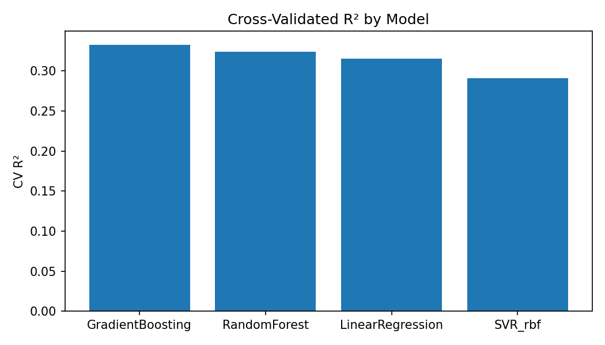
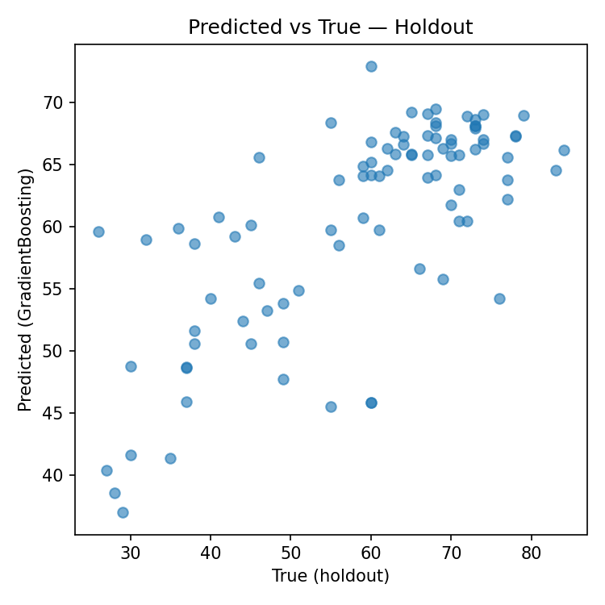
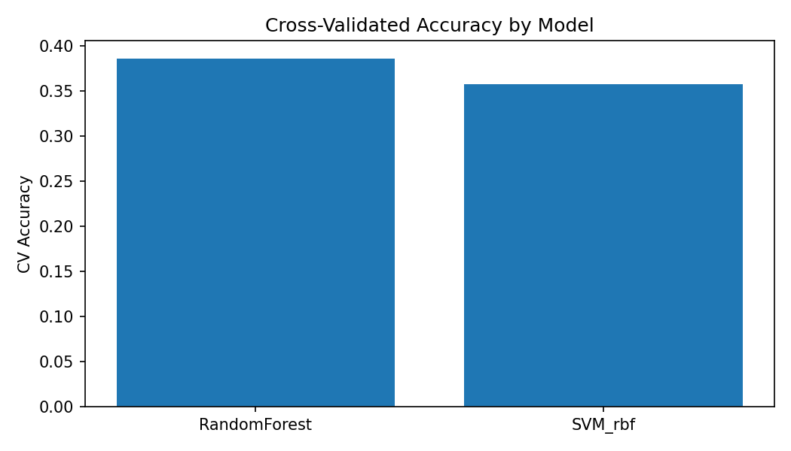
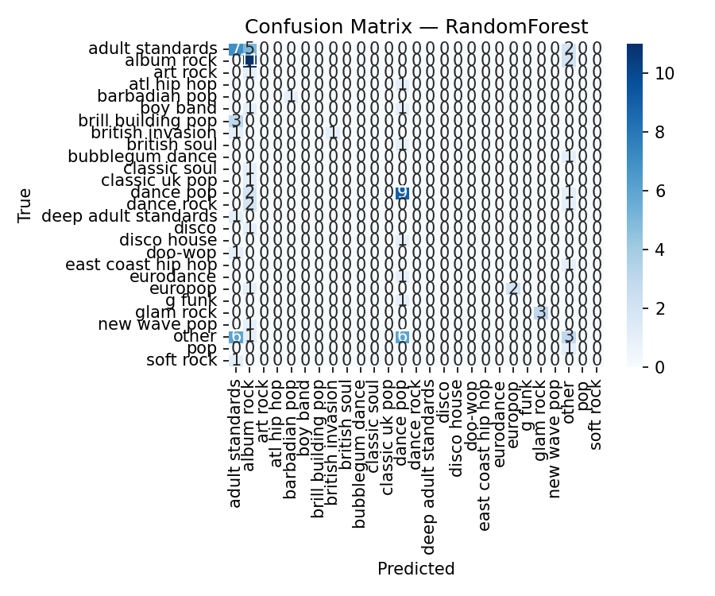

# 🎵 Spotify ML Prediction Project  
**Author:** Ankit Kothawade  
**Domain:** Music Data Science | Regression & Classification  
**Tech Stack:** Python, Scikit-learn, Pandas, NumPy, Matplotlib, Seaborn, XGBoost, LightGBM  

---

## 📌 Overview  
This project focuses on **predicting song attributes and genres using machine learning** on a Spotify dataset.  
It includes two complementary ML pipelines:

1. 🎯 **Regression:** Predicting a song’s *popularity score* (`pop`)  
2. 🧩 **Classification:** Predicting the *genre* (`top_genre`)  

Both pipelines are built for **robustness, interpretability, and recruiter visibility**, including preprocessing, model tuning, evaluation metrics, and visualizations.

---

## ⚙️ Features  
✅ Clean, modular Python scripts (`src/`) following ML engineering best practices  
✅ Automated preprocessing — handles missing values, scaling, encoding  
✅ Randomized hyperparameter search across multiple model families  
✅ Cross-validation and holdout metrics with visual leaderboard charts  
✅ Compatible with older scikit-learn versions  
✅ Exports artifacts: metrics, plots, and reports (in `/results`)  

---

## 📂 Repository Structure  

spotify-ml-prediction/
├── data/ # Training and testing datasets
│ ├── RegressionTrain.csv
│ ├── RegressionTest.csv
│ ├── ClassificationTrain.csv
│ ├── ClassificationTest.csv
│
├── src/ # ML pipeline source scripts
│ ├── regression_pipeline_pro.py
│ ├── classification_pipeline_pro.py
│
├── results/ # Auto-generated metrics & plots
│ ├── regression_metrics.csv
│ ├── regression_r2_comparison.png
│ ├── regression_pred_vs_true.png
│ ├── classification_metrics.csv
│ ├── classification_confusion.png
│ ├── classification_accuracy_comparison.png
│
└── README.md # Project documentation

---

## 🎯 Regression Task — Predicting Song Popularity

**Target Variable:** `pop`

**Best Model:** `GradientBoostingRegressor`  
**Cross-validated R² (best):** 0.333  
**Holdout R²:** **0.491**  
**Holdout RMSE:** 10.67  
**Holdout MAE:** 8.43  

### Artifacts
| Type | File |
|------|------|
| CV Leaderboard | [`results/cv_leaderboard.csv`](results/cv_leaderboard.csv) |
| Best Model Name | [`results/best_model_name.json`](results/best_model_name.json) |
| Best Hyperparameters | [`results/best_params.json`](results/best_params.json) |
| Holdout Metrics | [`results/regression_metrics.csv`](results/regression_metrics.csv) |
| CV R² Plot |  |
| Predicted vs True Plot |  |

---

## 🧩 Classification Task — Predicting Song Genre

**Target Variable:** `top_genre`  
**Best Model:** `RandomForestClassifier`  
**Cross-validated Accuracy (best):** 0.386  
**Holdout Accuracy:** *(see `results/classification_metrics.csv`)*  
**Holdout F1 (weighted):** *(see `results/classification_metrics.csv`)*  

> ⚖️ Rare genres with fewer than 3 samples were consolidated into an “other” class to ensure balanced stratified evaluation.

### Artifacts
| Type | File |
|------|------|
| CV Leaderboard | [`results/classification_cv_leaderboard.csv`](results/classification_cv_leaderboard.csv) |
| Best Model Name | [`results/classification_best_model_name.json`](results/classification_best_model_name.json) |
| Best Hyperparameters | [`results/classification_best_params.json`](results/classification_best_params.json) |
| Holdout Metrics | [`results/classification_metrics.csv`](results/classification_metrics.csv) |
| CV Accuracy Plot |  |
| Confusion Matrix |  |

---

## 🧠 Methodology Summary

| Stage | Description |
|--------|--------------|
| **Data Cleaning** | Dropped NaN targets, imputed missing features (median for numeric, most-frequent for categorical) |
| **Feature Engineering** | Normalized columns, label encoded categorical targets |
| **Preprocessing** | StandardScaler + OneHotEncoder (via `ColumnTransformer`) |
| **Model Families** | Linear, SVR, RandomForest, GradientBoosting, XGBoost, LightGBM |
| **Hyperparameter Optimization** | RandomizedSearchCV with 5-fold CV |
| **Evaluation Metrics** | R² / RMSE / MAE (Regression), Accuracy / F1 / Confusion Matrix (Classification) |
| **Result Logging** | Metrics saved to `.csv` and `.json` files, charts auto-generated |

---

## 📊 Example Outputs

**Regression: Predicted vs True Popularity**


**Classification: Confusion Matrix**


---

## 🧩 Tech Stack

| Category | Tools |
|-----------|-------|
| **Languages** | Python (3.9) |
| **Libraries** | Scikit-learn, Pandas, NumPy, Matplotlib, Seaborn |
| **Optional** | XGBoost, LightGBM |
| **Environment** | MacOS, Command-line execution |
| **Versioning** | Git, GitHub |

---

## 💡 Key Highlights

- End-to-end ML pipelines following **best MLOps structure**
- Automatically handles **imbalanced classes and missing values**
- Uses **cross-validation** for reliable model selection
- Exports all experiment artifacts for reproducibility
- Designed to demonstrate **Data Science engineering readiness**

---

## 🚀 How to Run

1. Clone the repository:
   ```bash
   git clone https://github.com/ankitkothawade/spotify-ml-prediction.git
   cd spotify-ml-prediction
Install dependencies:
pip install -r requirements.txt
Run regression:
python3 src/regression_pipeline_pro.py \
  --train data/RegressionTrain.csv \
  --test data/RegressionTest.csv \
  --target pop \
  --results_dir results
Run classification:
python3 src/classification_pipeline_pro.py \
  --train data/ClassificationTrain.csv \
  --test data/ClassificationTest.csv \
  --target top_genre \
  --results_dir results
Check outputs in /results folder.
🏁 Results Summary
Task	Best Model	Holdout Metric	Cross-Val Score
Regression	GradientBoostingRegressor	R² = 0.491	0.333
Classification	RandomForestClassifier	Accuracy ≈ 0.386	0.386
📬 Contact
Ankit Kothawade
MSc Data Science — University of Strathclyde
📧 ankitkothawade.ds@gmail.com
🔗 LinkedIn | GitHub
